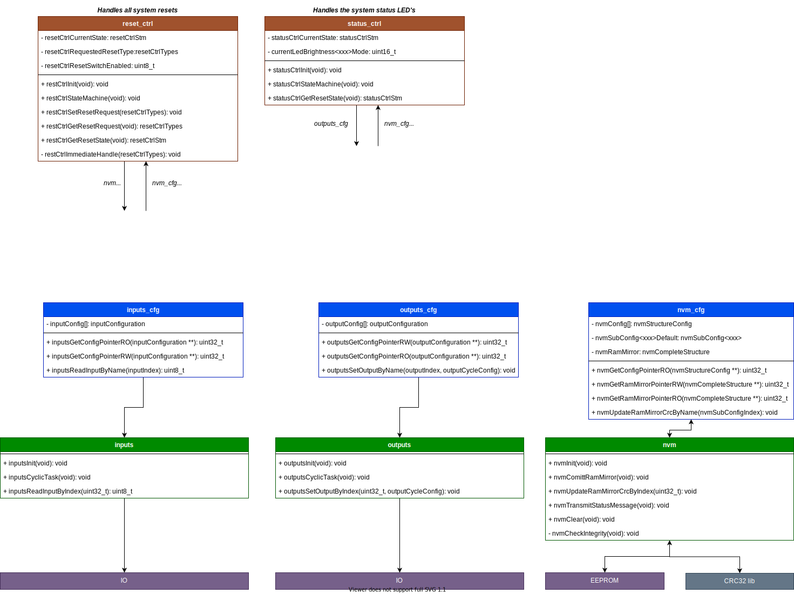

# Publisher

IoT gadget that sends / receives / acts on MQTT messages.

Using arduino library and PlatformIO to allow easy porting between ESP8266 / ESP32 / Raspberry Pi Pico.

Applications:

1. Alarm interface
* PIR states.
* Remote arm / disarm.

2. Garage door
* Door state.
* Open / Close.

3. Tank Water Level
* Water level.

## Software Architecture

